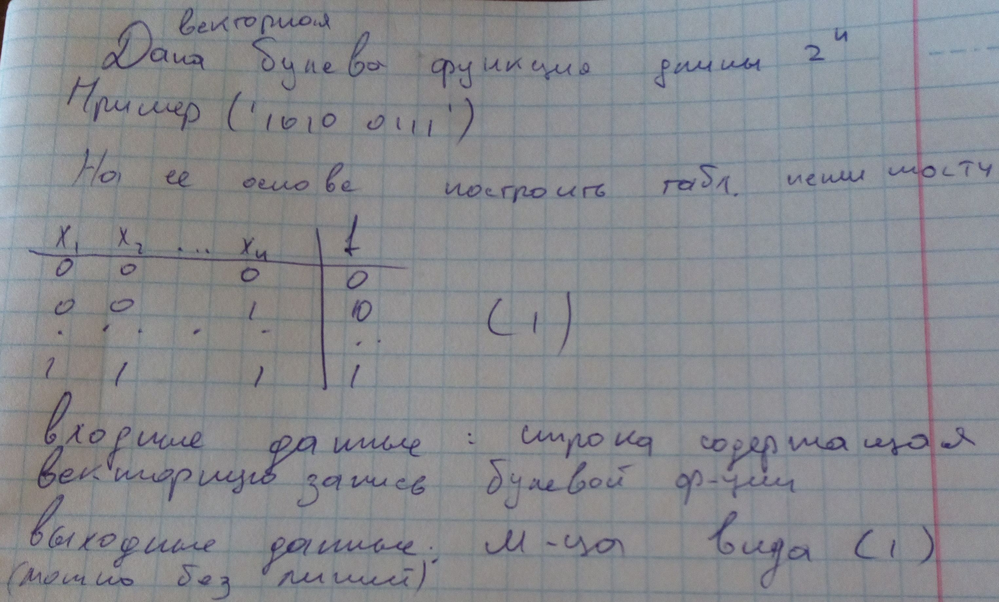

# Теория

<kbd></kbd>

<kbd></kbd>

<kbd></kbd>

# Задача

<kbd></kbd>

# Пример работы [программы](BooFoo.pas)

```text
ВХОДНЫЕ ДАННЫЕ
Введите строку содержащую векторную запись булевой функции:
00010111

ВЫХОДНЫЕ ДАННЫЕ
Матрица:
      x[1]      x[2]      x[3]         f
         0         0         0         0
         0         0         1         0
         0         1         0         0
         0         1         1         1
         1         0         0         0
         1         0         1         1
         1         1         0         1
         1         1         1         1
```

# Ссылки

- [Булевы функции](http://www.bmstu.ru/ps/~s_tkachev/fileman/download/%D0%94%D0%B8%D1%81%D0%BA%D1%80%D0%B5%D1%82%D0%BD%D0%B0%D1%8F%20%D0%BC%D0%B0%D1%82%D0%B5%D0%BC%D0%B0%D1%82%D0%B8%D0%BA%D0%B0/%D0%94%D0%BB%D1%8F%20%D0%BF%D0%B5%D1%87%D0%B0%D1%82%D0%B8/PP_Lec5.pdf)
