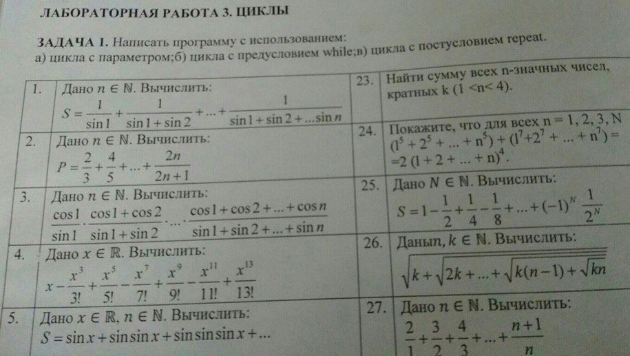

# Problem Statement

# References

- [Wolfram|Alpha Examples: Arbitrary Precision](https://www.wolframalpha.com/examples/mathematics/numbers/arbitrary-precision/)
- [Change the Format of Numbers&mdash;Wolfram Language Documentation](http://reference.wolfram.com/language/howto/ChangeTheFormatOfNumbers.html)
- [x - ( (x^3)/(3!) ) + ( (x^5)/(5!) ) - ( (x^7)/(7!) ) + ( (x^9)/(9!) ) - ( (x^11)/(11!) ) + ( (x^13)/(13!) ), x = 1](https://www.wolframalpha.com/input/?i=x+-+(+(x%5E3)%2F(3!)+)+%2B+(+(x%5E5)%2F(5!)+)+-+(+(x%5E7)%2F(7!)+)+%2B+(+(x%5E9)%2F(9!)+)+-+(+(x%5E11)%2F(11!)+)+%2B+(+(x%5E13)%2F(13!)+),+x+%3D+1)
- [N[209594293/249080832, 15]](https://www.wolframalpha.com/input/?i=N%5B209594293%2F249080832,+15%5D)
- [Pascal Variable Types](https://www.tutorialspoint.com/pascal/pascal_variable_types.htm)
