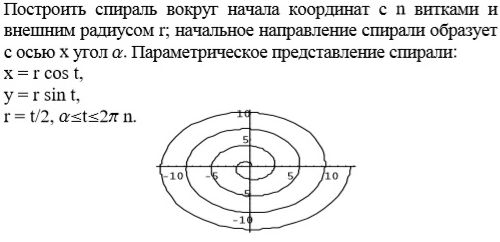
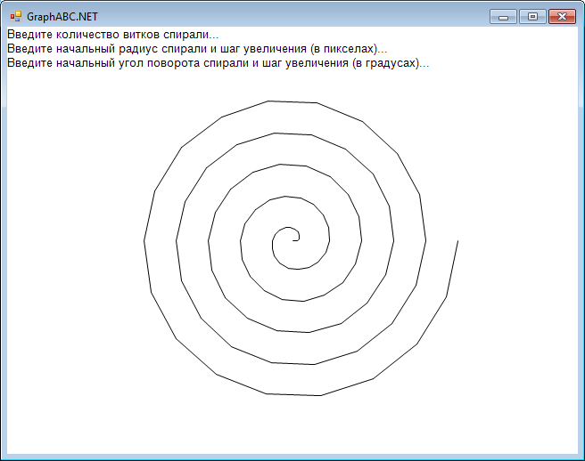

# Задача

<kbd></kbd>

# Скриншот

<kbd></kbd>

# Ссылки

- [Графика, графика, графика! Часть 1. Введение.](http://pascalabc.net/stati-po-pascalabc-net/obuchenie-programmirovaniyu/16-grafika-grafika-grafika-chast-1-vvedenie)
- [Pascal спираль - Помощь студентам  - Форум программистов](http://www.programmersforum.ru/showpost.php?s=9e5526395b84fa9ca7f370a9568277cb&p=934419&postcount=6)
- [Нарисовать спираль](https://vk.com/page-37477344_44493176)
