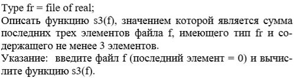

# Задача

<kbd></kbd>

# Ссылки

- [Formatting output - Lazarus wiki](http://wiki.lazarus.freepascal.org/Formatting_output)
- [Работа с файлами](https://pas1.ru/files)
- [Random](http://www.pascal.su/random/)
- [Case - Free Pascal wiki](http://wiki.freepascal.org/Case)
- [Pascal Programming/Syntax and functions - Wikibooks, open books for an open world](https://en.wikibooks.org/wiki/Pascal_Programming/Syntax_and_functions)

